# Installing Python - Windows 11 guide

- [Installing Python - Windows 11 guide](#installing-python---windows-11-guide)
	- [Setting up the table (optional)](#setting-up-the-table-optional)
		- [Showing `file name extensions`](#showing-file-name-extensions)
		- [Setting up the Terminal](#setting-up-the-terminal)
	- [Checking if python is already installed](#checking-if-python-is-already-installed)
	- [Installing Python](#installing-python)
		- [Downloading a python installer](#downloading-a-python-installer)
		- [Running the installer](#running-the-installer)
	- [Validating that the installation was a success](#validating-that-the-installation-was-a-success)
		- [Installing a package with `pip`](#installing-a-package-with-pip)
	- [Adding directories to PATH](#adding-directories-to-path)
	- [Uninstalling python and cleaning up](#uninstalling-python-and-cleaning-up)
		- [Uninstalling python](#uninstalling-python)
		- [Cleaning up Appdata](#cleaning-up-appdata)

## Setting up the table (optional)

Before you go through with installing python, there are a few things that I recommend you do with your system. All of this is optional, of course, so feel free to skip this section.

### Showing `file name extensions`

Most files have an extension name, and it is usually very helpful to know what it is at a glance. To enable this feature,

1. Open `File Explorer`
2. Click on the `View` menu
3. Go to `Show`
4. Check `File name extensions`

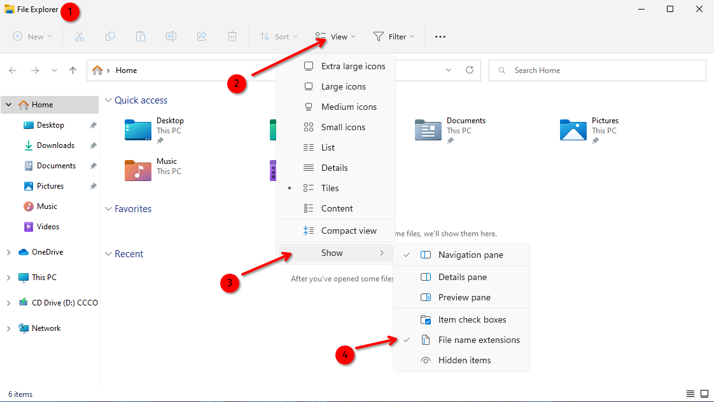

### Setting up the Terminal

The Terminal is an incredibly powerful tool, even though a bit scary at first (trust me, I get it). After decades of abandon, Microsoft massively improved its features in Windows 11. To make it even more accessible and useful, I like to pin it to the taskbar and to change the default profile to `Command Prompt`.

1. Pin it to the taskbar
   1. Click the `start menu`
   2. Search for `Terminal`
   3. Right click `Terminal`
   4. Click `Pin to taskbar`
2. Change the default profile to `Command Prompt`
   1. Launch `Terminal`
   2. Click the down menu arrow
   3. Open the `Settings` menu
   4. Change the `Default profile` to `Command Prompt`

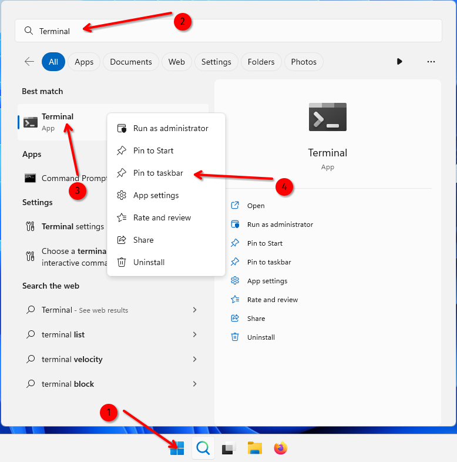
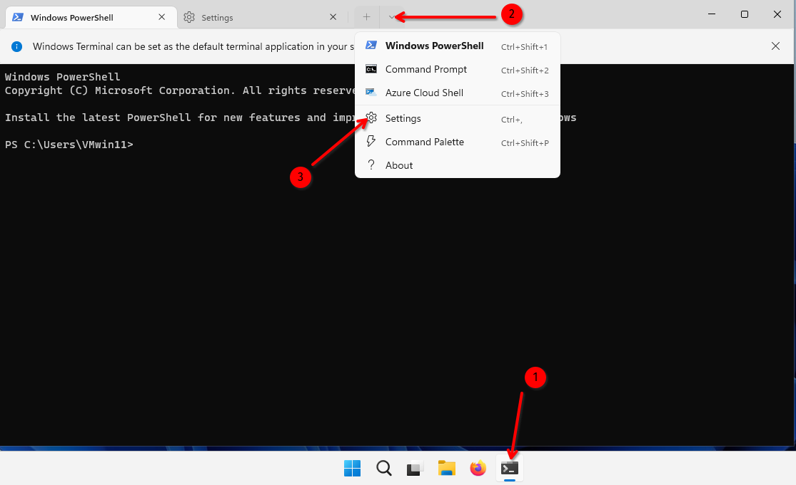
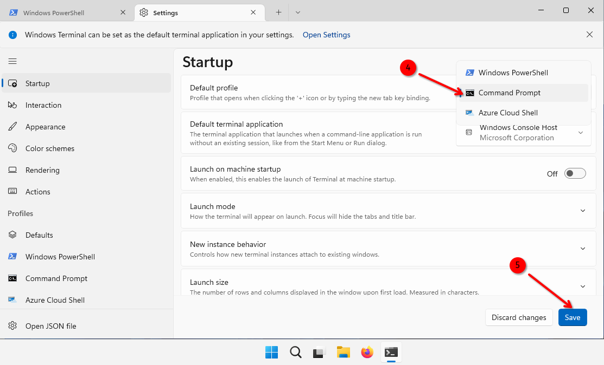

## Checking if python is already installed

1. Launch Terminal
2. Run `python`
3. Python is **installed** if you get a prompt that looks like:
   - `Python 3.10.11 ... Type "help", "copyright", ...`
4. Python is **not installed** if you get a prompt about `'python' is not recognized as an internal or external command` or if nothing happens and the Windows store is launched.

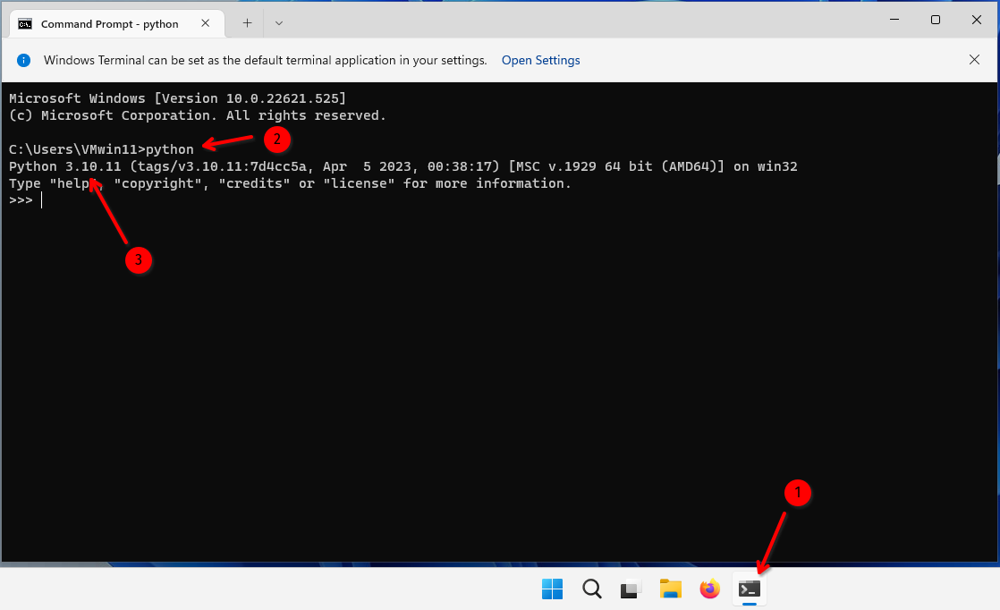

## Installing Python

### Downloading a python installer

Here is a download link for the windows 64-bit installer for python 3.10.11 : https://www.python.org/ftp/python/3.10.11/python-3.10.11-amd64.exe.

Otherwise,

1. Go to www.python.org
2. Go to the downloads section for windows (or https://www.python.org/downloads/windows/)
3. Find a version of python that has a `Download Windows installer (64-bit)` link (32-bit might be the one you need if you are running a 32-bit system, otherwise pick 64-bit)
4. As of April 2023, I recommend using the latest revision of python 3.10.

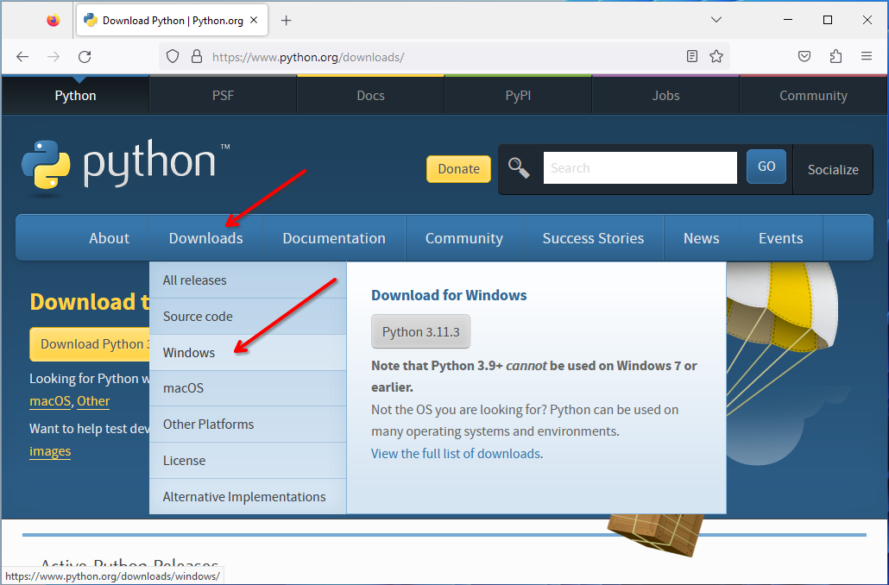
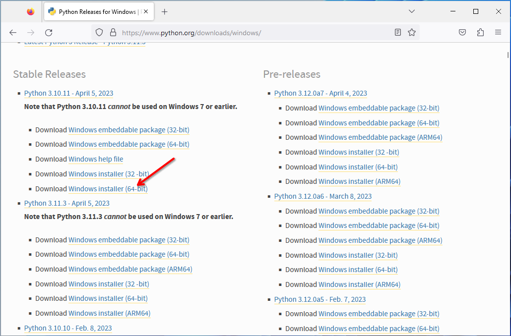

### Running the installer

1. Run the installer you downloaded (in this example, its name is `python-3.10.11-amd64.exe`)
2. Follow the screenshots **CAREFULLY** (selecting different options might lead to problems and you'll have to uninstall everything and start over)
3. On the first page:
   1. Check `Use admin privileges when installing py.exe`
   2. Check `Add python.exe to PATH`
   3. Click `Customize installation`
4. On the second page:
   1. Check EVERYTHING
5. On the third page:
   1. Check EVERYTHING
   2. Make sure the `Customize install location` is `C:\Program Files\PythonXX`, no somewhere in `C:\Users\...\AppData\Local\...`
   3. Click `Install`
6. After the installation:
   1. You should see that `Setup was successful`
   2. Click the button to `Disable path length limit` if you see it. If not, it means the path length limit has already been disabled on your system.
   3. Close the installer.
7. Verify that python was installed by running `python` in your terminal
   1. If so, you will see

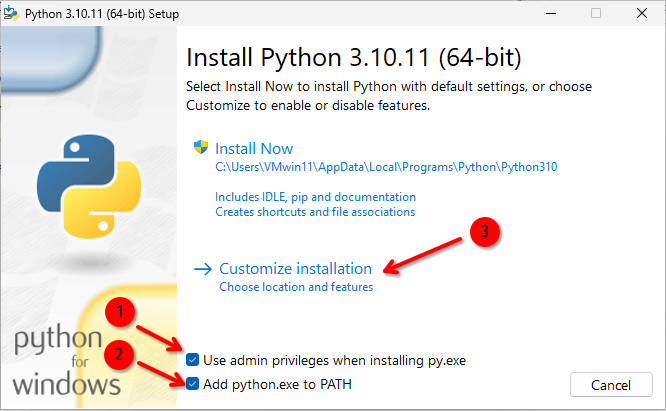
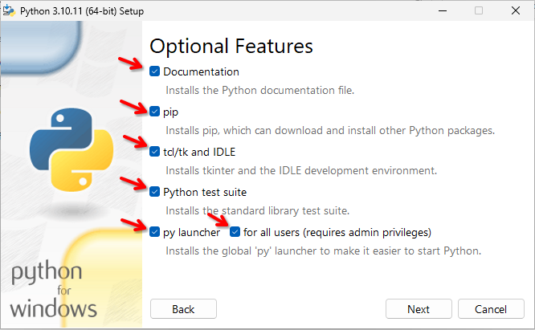
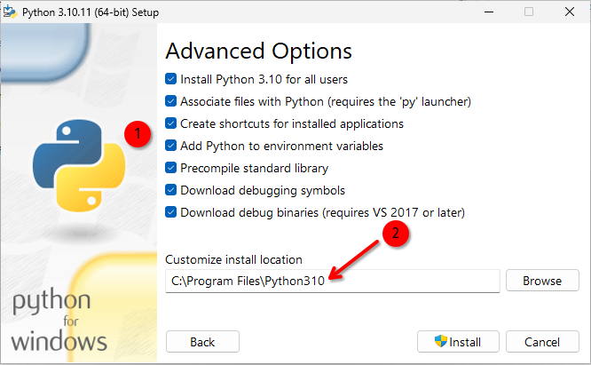
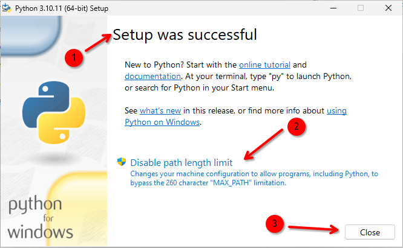

## Validating that the installation was a success

Now that we went through the installation, we verify that `python` and `pip` were installed by

1. Opening Terminal
2. Running `python`
3. Python is **installed** if you get a prompt that looks like:
   - `Python 3.10.11 ... Type "help", "copyright", ...`
4. Exit python by running `exit()` (or opening a new terminal)
5. Running `pip`
6. Pip is installed if you get the help text that starts with `Usage: pip <command> [options] ...`

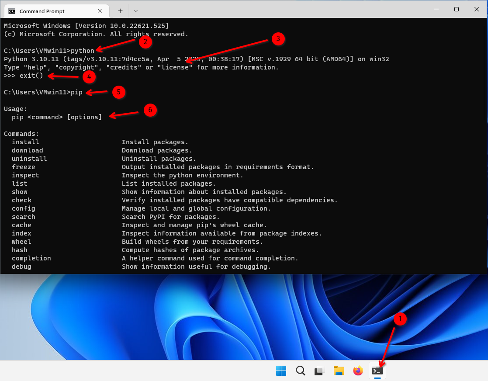

### Installing a package with `pip`

Pip is the python package manager. It is used to install python packages hosted on the python package index (www.pypi.org). To install a package, the syntax is `pip install package_to_install`. For example (I suggest you try this), to install `numpy` (https://numpy.org/), you

1. Open terminal
2. Run `pip install numpy`
3. pip will download what it needs (the numpy wheel and its dependencies) and install numpy
4. We can check that numpy was installed by running `python`
5. and checking that we can `import numpy` without error

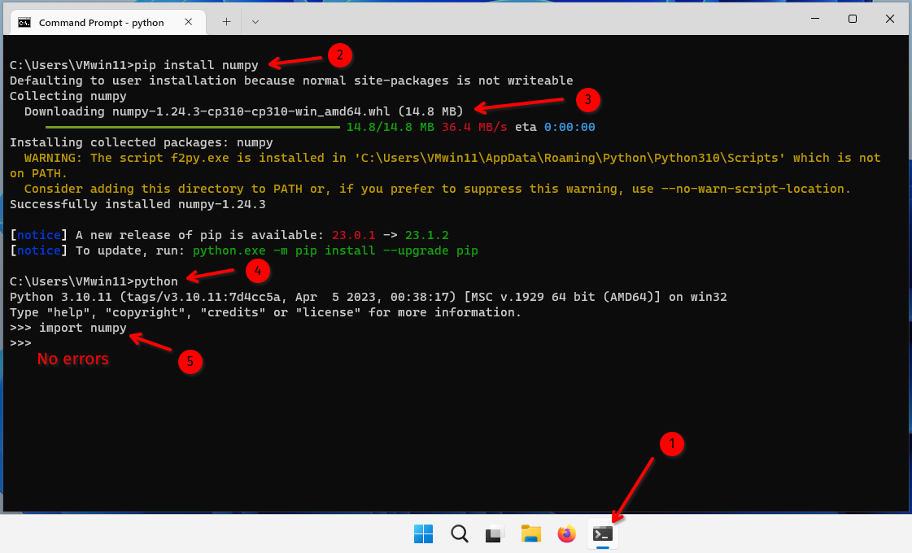

## Adding directories to PATH

If you followed the guide so far, you might notice that installing `numpy` with `pip` results in some yellow warnings in your terminal. The warning reads (see previous image)

```
WARNING: The script f2py.exe is installed in 'C:\Users\VMwin11\AppData\Roaming\Python\Python310\Scripts' which is not on PATH.
  Consider adding this directory to PATH or, if you prefer to suppress this warning, use --no-warn-script-location.
```

This means that you won't be able to directly run things that were installed in the specified directory from the terminal (in this example, `f2py.exe`). This might not be a problem for you when using `numpy`, but will prevent you from running `jupyter lab` or `ipython` or other similar tools.

To add a directory to your PATH, you

1. Click the start menu icon
2. Search for `environment variables`
3. Launch the `Edit the system environment variables` program
4. Click `Environment Variables...`
5. Select the user's `Path` variable
6. Click `Edit...`
7. Click `New`
8. Add the directory you want to add to PATH
9. click `Ok` until you closed the 3 windows

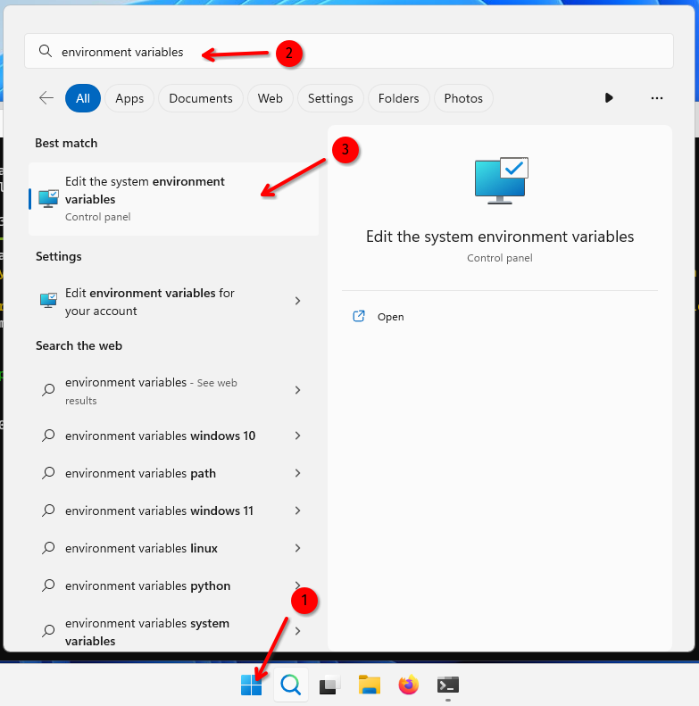
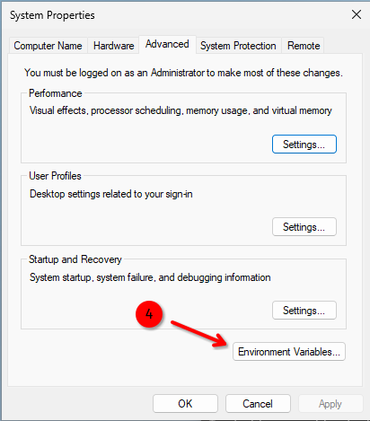
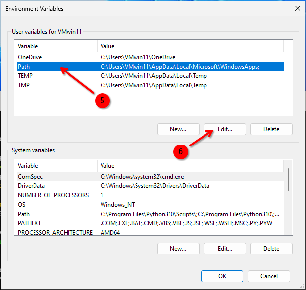
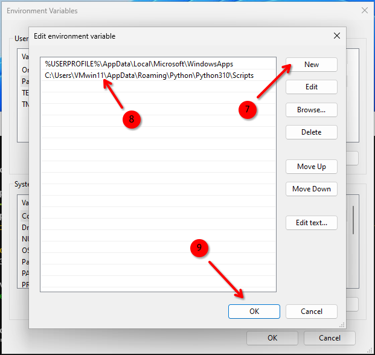

## Uninstalling python and cleaning up

### Uninstalling python

1. Right-click on the `start menu`
2. Click on `Installed apps`
3. Search for `python`
4. Click the `...`
5. Click `Uninstall`
6. Run the Uninstall (click `yes` if you have a prompt from windows)
7. Check that `Uninstall was successful`

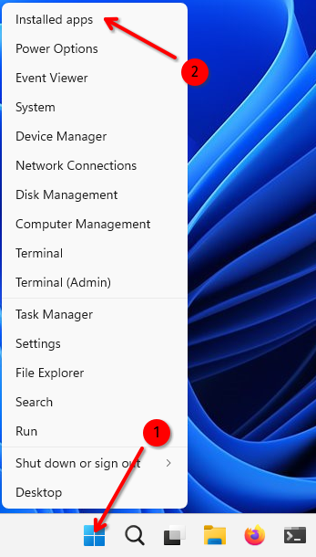
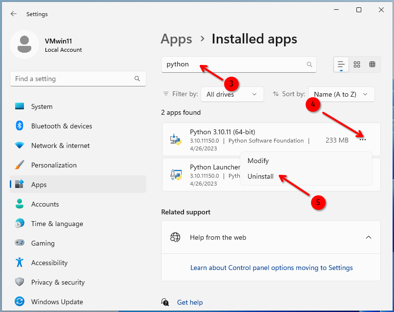
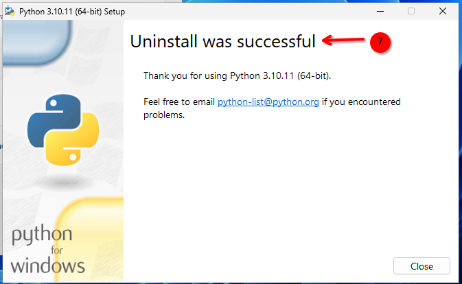

### Cleaning up Appdata

You might have some files left in your `AppData` directory. It is a good idea to clean that up.

1. The `AppData` directory is hidden. To open it, click the `start menu`.
2. Search for `%appdata%`.
3. Click the `%appdata%` folder
4. This brings you to `AppData\Roaming` (I know... I know... I have no clue why Microsoft made it that way...). You want to go up a level by clicking on `AppData`
5. The `AppData` directory is made up of `Local`, `LocalLow` and `Roaming`. You might have python related files left in all three depeding on your previous installation. It's a good idea to go through all of them and look for files and directories names `python` or `pip`. Make sure you look into `AppData\Local\Programs\` (but DO NOT delete it)
6. Delete /pip/
7. Delete /python/ if you find it in `AppData\Local\Programs\`

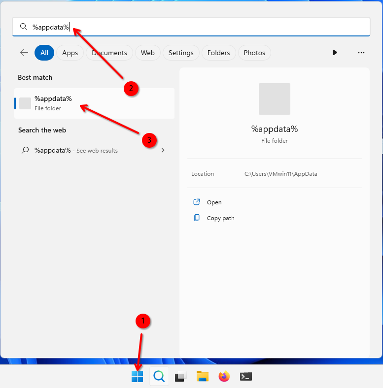
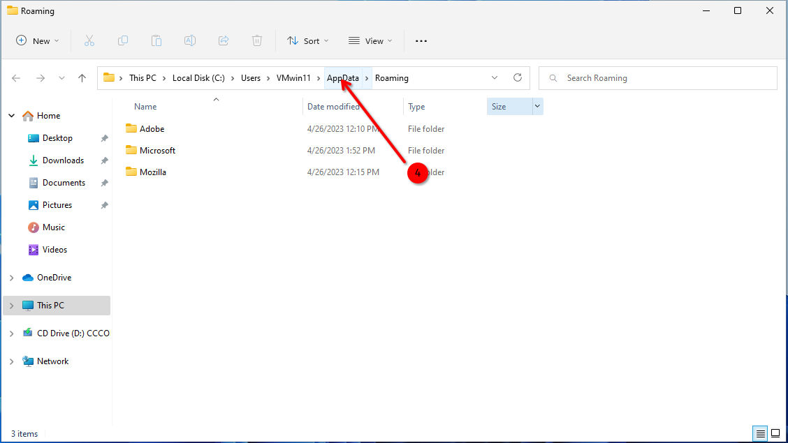
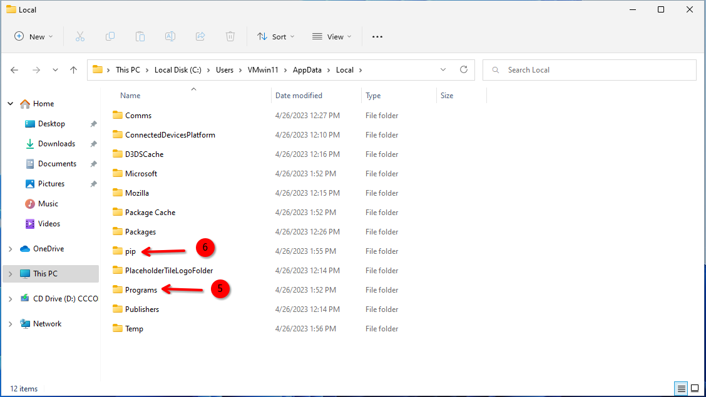
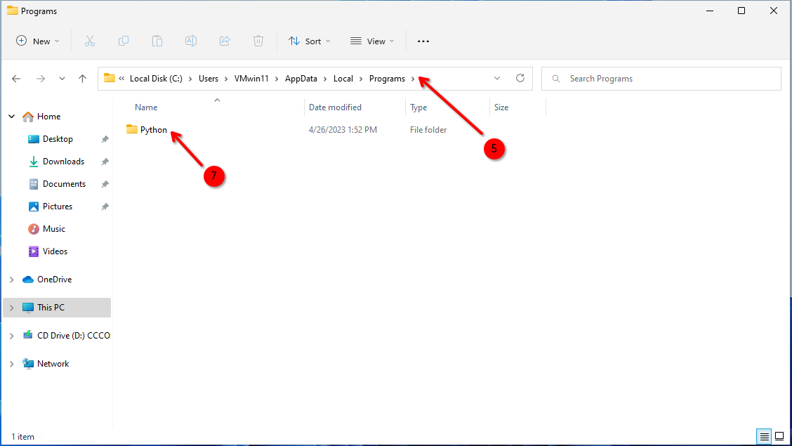
